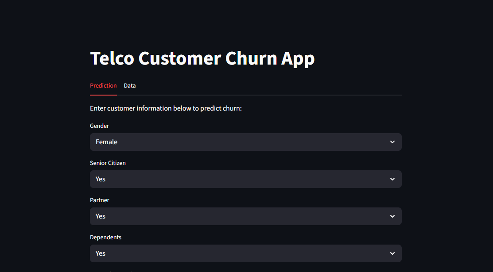
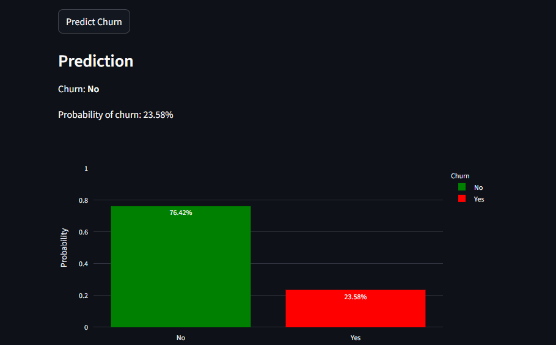
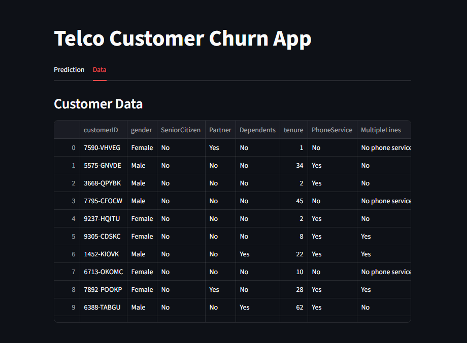

# Telco Customer Churn Prediction App

## Overview

This project provides a machine learning solution to predict customer churn for a telecommunications company. Using a cleaned Telco Customer Churn dataset, the app allows users to input customer information and receive a prediction of whether the customer is likely to churn, along with the probability.

The app is built with **Streamlit** for an interactive front-end, and the model is trained using a **Random Forest classifier** (other models tested include Logistic Regression and XGBoost). Preprocessing is handled via a **sklearn pipeline** to ensure consistent feature transformations.

---

## Features

1. **Interactive Prediction**

   * Users can input customer information through a friendly form.
   * Predicts churn (Yes/No) and displays probability.
   * Visual bar chart showing probability of churn using Plotly.

2. **Data Tab**

   * View the full dataset in an interactive table.

3. **Preprocessing Pipeline**

   * Handles categorical, binary, and numeric features.
   * Includes one-hot encoding and MinMax scaling.
   * Compatible with multiple classifiers.

4. **Model**

   * Random Forest Classifier selected as the best model.
   * Hyperparameters optimized using GridSearchCV.
   * Supports handling class imbalance with `class_weight='balanced'`.

---

## Project Structure

```
customer_churn_prediction
├── LICENSE
├── README.md
├── app.py
├── data
│   └── WA_Fn-UseC_-Telco-Customer-Churn.csv
├── images
│   ├── churn proj data table.png
│   ├── churn proj prediction.png
│   └── churnproj.png
├── models
│   └── best_churn_model.pkl
├── notebooks
│   ├── customer_churn_classification_model.ipynb
│   └── customer_churn_eda.ipynb
└── requirements.txt
```

---

## Installation

1. **Clone the repository**

```bash
git clone https://github.com/yourusername/telco-churn-project.git
cd telco-churn-project
```

2. **Install dependencies**

```bash
pip install -r requirements.txt
```

> Make sure to have the following versions to match the model environment:
> `scikit-learn==1.6.1`, `joblib==1.5.2`, `pandas`, `streamlit`, `plotly`

---

## Running the App

```bash
streamlit run app.py
```

* Open the URL displayed in the terminal (usually `http://localhost:8501`)
* Navigate between **Prediction** and **Data** tabs

---

## Usage

1. **Prediction Tab**

   * Fill out the customer information form.
   * Click **Predict Churn**.
   * View predicted churn (Yes/No), probability, and bar chart.

2. **Data Tab**

   * View the full Telco customer dataset in an interactive table.

---

## Model Training

* Dataset: [WA_Fn-UseC_-Telco-Customer-Churn.csv](https://www.kaggle.com/blastchar/telco-customer-churn)
* Preprocessing:

  * Binary columns: One-hot encoded
  * Categorical columns: One-hot encoded with first category dropped
  * Numeric columns: MinMaxScaler
* Models tested:

  * Logistic Regression
  * Random Forest Classifier
  * XGBoost Classifier
* Metric for selection: **F1-score** (to account for class imbalance)

---

## Notes

* The app uses a trained pipeline saved with `joblib`.
* Ensure the model file (`best_churn_model.pkl`) is located in the `models/` folder.
* Class imbalance is handled with `class_weight='balanced'` in tree-based models.

---

## Dependencies

```txt
pandas
numpy
scikit-learn==1.6.1
joblib==1.5.2
streamlit
plotly
```

---

## Screenshots

**Prediction Tab:**




**Data Tab:**



---

## License

This project is licensed under the MIT License.

---
